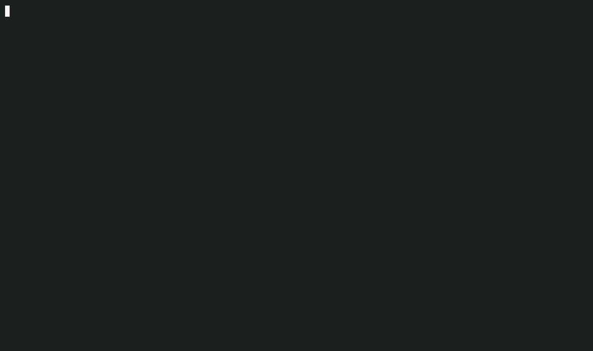

# turbine-cli

An unofficial command line for [Turbine](https://docs.turbine.exchange), the private orderbook on Ethereum: quote, place, ladder and watch spread orders from your terminal or your agent.

> turbine-cli is an unofficial community tool, not affiliated with or endorsed by Turbine or PropellerHeads.



<sub>Recorded with `npm run demo:record` against the local mock (`npm run mock`, with faster fills): no network, no real funds.</sub>

Turbine matches orders privately and settles them onchain in batches. An order there is a spread around the mid price that follows the market, rather than a fixed price. turbine-cli puts that in a terminal: one command per action for scripts and agents, and an interactive session when you type `turbine` on its own.

What it does and how it behaves, command by command, is in [TURBINE-CLI.md](TURBINE-CLI.md).

## Safety first

- **Playground by default.** Turbine's playground simulates fills: no real funds move. Mainnet needs `--network mainnet` and a confirmation before any order, cancel or approval.
- **`--dry-run` everywhere.** See the exact typed data a wallet would sign, or the exact transaction, without signing or sending anything.
- **Your key stays encrypted.** Wallets are Web3 Secret Storage keystores (the format Foundry and geth use), unlocked with a password. A key is never read from an argument, an environment variable or a file, and anything that looks like one on the command line is refused.
- **Errors say what to do, never more.** Every error is one of a fixed catalogue with a stable code and a hint; raw upstream text, stack traces and secrets never reach the output.

Use a dedicated wallet with a small balance, and a fresh one for the playground: a Permit2 signature made there is valid on mainnet too, until the order ends.

## Install

Node.js 24 or later.

```sh
git clone https://github.com/mfbz/turbine-cli.git
cd turbine-cli
npm ci
npm run build
npm link        # puts `turbine` on your PATH
```

turbine-cli isn't on npm yet.

## Quick start

```sh
turbine                                  # the interactive session
turbine wallet new                       # an encrypted wallet for the playground
turbine quote 1 WETH USDC --spread 20    # mid price, fee, and the least 20 bps would bring
turbine order place 1 WETH --for USDC --spread 20 --ttl 1h --dry-run
turbine order place 1 WETH --for USDC --spread 20 --ttl 1h
turbine order watch 0x…                  # live: q to stop watching, c to cancel
```

## Commands

| Command                                                                                                | What it does                                                                 |
| ------------------------------------------------------------------------------------------------------ | ---------------------------------------------------------------------------- |
| `turbine`                                                                                              | The interactive session: Turbine's logo, then a menu of everything below.    |
| `turbine config`                                                                                       | The network, API, RPC endpoint and wallet in use.                            |
| `turbine wallet new\|import\|list`                                                                     | Create or import an encrypted wallet; list them, Foundry keystores included. |
| `turbine tokens`                                                                                       | The tokens Turbine supports on this network.                                 |
| `turbine quote <amount> <sell> <buy> [--spread <bps>]`                                                 | Mid price, Turbine's fee, and what a spread would bring. Signs nothing.      |
| `turbine order place <amount> <token> --for <token> --spread <bps> --ttl <duration> [--limit <price>]` | Place a spread order that follows the mid price.                             |
| `turbine ladder <amount> <token> --for <token> --levels <n> --from <bps> --to <bps> --ttl <duration>`  | Split an amount into orders at evenly spaced spreads, sent as one batch.     |
| `turbine orders [--status <list>] [--max <n>]`                                                         | The wallet's orders, newest first.                                           |
| `turbine order watch <hash>`                                                                           | Follow an order live until it is filled, expires or is cancelled.            |
| `turbine order cancel <hash>`                                                                          | Cancel an open order.                                                        |
| `turbine approve <token> [--amount <amount>]`                                                          | Let Permit2 move a token you sell: once per token, an Ethereum transaction.  |

Every command takes `--network`, `--account <wallet>`, `--password-file <path>`, `--json`, `--dry-run`, `--yes`, `--no-motion` and `--debug`.

Spreads are in basis points from the mid price: `20` trades up to 0.2% worse than mid, `-10` only 0.1% better or more. Amounts are in whole tokens (`1.5`). Durations look like `90s`, `30m`, `4h` or `2d`.

### A ladder

A market maker's way of quoting: several orders at evenly spaced spreads.

```sh
turbine ladder 10 WETH --for USDC --levels 5 --from -10 --to 30 --ttl 4h --dry-run
```

That is five orders of 2 WETH at -10, 0, 10, 20 and 30 bps. The summary lists every level and what each signs, and all of them go to Turbine in one batch.

## Try it without Turbine

`npm run mock` starts a local stand-in for Turbine's playground on `127.0.0.1:4646`: tokens and quotes, signed orders through the real SDK, fills that arrive over about 20 seconds, cancels after a 12-second Speedbump, and a mid price that drifts. It is for demos and development when the playground is out of reach, and never part of the package.

```sh
npm run mock                                       # terminal 1

export TURBINE_API_URL=http://127.0.0.1:4646/api   # terminal 2
export TURBINE_RPC_URL=http://127.0.0.1:4646/rpc
turbine wallet new demo
turbine --account demo ladder 3 WETH --for USDC --levels 3 --from -10 --to 30 --ttl 1h
turbine --account demo orders
turbine --account demo order watch 0x…             # fills arrive; q to stop, c to cancel
turbine --account demo order cancel 0x…            # the -10 bps level waits: cancel it
```

To the mock, every wallet holds no tokens and has Permit2 approved, so summaries warn about the balance and nothing else. Orders fill in three steps, never below their limit and never after they end; finished orders can't be cancelled. It doesn't verify signatures: it shows turbine-cli's side of the flow, not Turbine's checks or matching.

What a wallet signs there is the same Ethereum data a real order would (Turbine's settler, chain 1), and it never leaves your computer. Use a fresh wallet anyway, as on the playground.

## Scripts and agents

`--json` prints exactly one JSON document on stdout: `{ "ok": true, "data": … }`, or `{ "ok": false, "error": { "code", "message", "hint", "retryable" } }` with a non-zero exit code. `turbine order watch --json` streams one document per change. Exit codes: `0` done, `1` failed, `2` usage error, `130` cancelled or interrupted.

Without a terminal, a wallet is unlocked with `--password-file <path>` (`chmod 600`) or `TURBINE_WALLET_PASSWORD` set in your own shell, and anything with real funds needs `--yes`.

[`skills/turbine/SKILL.md`](skills/turbine/SKILL.md) is an Agent Skill that teaches a coding agent to use turbine-cli safely: quote first, dry-run always, ask you before anything is signed, never touch keys or passwords. Copy the `skills/turbine` folder into your agent's skills folder (for Claude Code, `~/.claude/skills/`).

## Configuration

Settings come from flags or from your shell's environment, never from a `.env` file in the current folder: `TURBINE_NETWORK`, `TURBINE_ACCOUNT`, `TURBINE_RPC_URL` (your own Ethereum RPC, for balance and allowance checks), `TURBINE_NO_MOTION`, `TURBINE_WALLET_PASSWORD`. `NO_COLOR` turns colour off. The full list is in [TURBINE-CLI.md](TURBINE-CLI.md#configuration).

## Development

```sh
npm ci
npm run check              # format, lint, types and tests
npm run cli -- quote 1 WETH USDC
npm run smoke:playground   # reads and dry runs against the live playground; signs nothing
```

[CONTRIBUTING.md](CONTRIBUTING.md) covers the workflow, [AGENTS.md](AGENTS.md) the rules coding agents follow here, [DESIGN.md](DESIGN.md) the terminal design, and [SECURITY.md](SECURITY.md) how to report a vulnerability.

## Credits

Turbine is built by PropellerHeads. turbine-cli signs and sends orders through the official [Turbine SDK](https://github.com/propeller-heads/turbine-sdk) and follows [Turbine's documentation](https://docs.turbine.exchange).

## License

[MIT](LICENSE). Turbine's name and logo belong to PropellerHeads; the logo drawn in the terminal is not covered by the MIT licence ([notice](assets/brand/NOTICE.md)).
